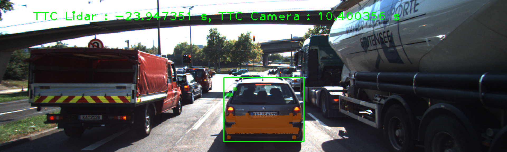
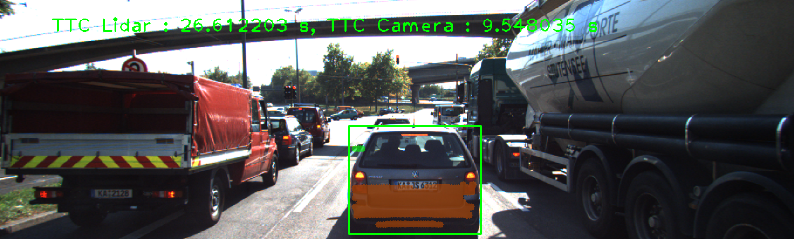

# SFND 3D Object Tracking

Welcome to the final project of the camera course. By completing all the lessons, you now have a solid understanding of keypoint detectors, descriptors, and methods to match them between successive images. Also, you know how to detect objects in an image using the YOLO deep-learning framework. And finally, you know how to associate regions in a camera image with Lidar points in 3D space. Let's take a look at our program schematic to see what we already have accomplished and what's still missing.


In this final project, you will implement the missing parts in the schematic. To do this, you will complete four major tasks: 
1. First, you will develop a way to match 3D objects over time by using keypoint correspondences. 
2. Second, you will compute the TTC based on Lidar measurements. 
3. You will then proceed to do the same using the camera, which requires to first associate keypoint matches to regions of interest and then to compute the TTC based on those matches. 
4. And lastly, you will conduct various tests with the framework. Your goal is to identify the most suitable detector/descriptor combination for TTC estimation and also to search for problems that can lead to faulty measurements by the camera or Lidar sensor. In the last course of this Nanodegree, you will learn about the Kalman filter, which is a great way to combine the two independent TTC measurements into an improved version which is much more reliable than a single sensor alone can be. But before we think about such things, let us focus on your final project in the camera course. 

## Dependencies for Running Locally
* cmake >= 2.8
  * All OSes: [click here for installation instructions](https://cmake.org/install/)
* make >= 4.1 (Linux, Mac), 3.81 (Windows)
  * Linux: make is installed by default on most Linux distros
  * Mac: [install Xcode command line tools to get make](https://developer.apple.com/xcode/features/)
  * Windows: [Click here for installation instructions](http://gnuwin32.sourceforge.net/packages/make.htm)
* OpenCV >= 4.1
  * This must be compiled from source using the `-D OPENCV_ENABLE_NONFREE=ON` cmake flag for testing the SIFT and SURF detectors.
  * The OpenCV 4.1.0 source code can be found [here](https://github.com/opencv/opencv/tree/4.1.0)
* gcc/g++ >= 5.4
  * Linux: gcc / g++ is installed by default on most Linux distros
  * Mac: same deal as make - [install Xcode command line tools](https://developer.apple.com/xcode/features/)
  * Windows: recommend using [MinGW](http://www.mingw.org/)

## Basic Build Instructions

1. Clone this repo.
2. Make a build directory in the top level project directory: `mkdir build && cd build`
3. Compile: `cmake .. && make`
4. Run it: `./3D_object_tracking`.

## Assignment Report

This section contains the reports of the project.

### FP.1 - Match 3D Objects

__Criteria__: Implement the method "matchBoundingBoxes", which takes as input both the previous and the current data frames and provides as output the ids of the matched regions of interest (i.e. the boxID property). Matches must be the ones with the highest number of keypoint correspondences.

__Answer__: The `matchBoundingBoxes` function was implemented.

```C++
void matchBoundingBoxes(std::vector<cv::DMatch> &matches, std::map<int, int> &bbBestMatches, DataFrame &prevFrame, DataFrame &currFrame){

    // use the matched keypoints to find the bounding boxes that contain them
    // loop over all matches

    cv::Mat match_table = cv::Mat::zeros(prevFrame.boundingBoxes.size(), currFrame.boundingBoxes.size(), CV_32S);

    for (const auto &match : matches){
        const cv::KeyPoint &prev_keypoint = prevFrame.keypoints[match.queryIdx];
        const cv::KeyPoint &curr_keypoint = currFrame.keypoints[match.trainIdx];

        // find the bounding boxes that contain the matched keypoints
        for (const auto &prev_bbox : prevFrame.boundingBoxes){
            if (prev_bbox.roi.contains(prev_keypoint.pt)){
                for (const auto &curr_bbox : currFrame.boundingBoxes){
                    if (curr_bbox.roi.contains(curr_keypoint.pt)){
                        match_table.at<int>(prev_bbox.boxID, curr_bbox.boxID) += 1;
                    }
                }
            }
        }
    }
    
    // find the best matches
    for (int i = 0; i < match_table.rows; i++){
        
        int max_count = 0;
        int max_id = -1;

        for (int j = 0; j < match_table.cols; j++){
            if (match_table.at<int>(i, j) > max_count && match_table.at<int>(i, j) > 0){
                max_count = match_table.at<int>(i, j);
                max_id = j;
            }
        }

        if (max_id != -1){
            bbBestMatches.emplace(i, max_id);
        }
    }
}
```

### FP.2 - Compute Lidar-based TTC

__Criteria__: Compute the time-to-collision (TTC) in second for all matched 3D objects using only Lidar measurements from the matched bounding boxes between current and previous frame.

__Answer__: The `computeTTCLidar` function was implemented. Instead of calculating the mean, we store all x-coordinates in a vector and then sort the vector. The median is then the middle element of the sorted vector. This approach is more robust to filter outliers.

```C++
void computeTTCLidar(std::vector<LidarPoint> &lidarPointsPrev,
                     std::vector<LidarPoint> &lidarPointsCurr, double frameRate, double &TTC)
{
    // auxiliary variables
    double lane_width = 4.0; // Assuming lane width is 4 meters
    std::vector<double> x_values_prev, x_values_curr;

    for (auto it = lidarPointsPrev.begin(); it != lidarPointsPrev.end(); ++it){
        // Filter out points that are not in the ego lane
        if(abs(it->y) <= lane_width / 2.0){
            x_values_prev.push_back(it->x);
        }
    }

    for (auto it = lidarPointsCurr.begin(); it != lidarPointsCurr.end(); ++it){
        // Filter out points that are not in the ego lane
        if(abs(it->y) <= lane_width / 2.0){
            x_values_curr.push_back(it->x);
        }
    }

    // Sort the vectors to find the median
    std::sort(x_values_prev.begin(), x_values_prev.end());
    std::sort(x_values_curr.begin(), x_values_curr.end());

    // Compute the median
    double x_median_prev = x_values_prev[x_values_prev.size() / 2];
    double x_median_curr = x_values_curr[x_values_curr.size() / 2];

    // compute TTC from both measurements
    TTC = x_median_curr * (1.0 / frameRate) / (x_median_prev - x_median_curr);

    // print TTC
    std::cout << "TTC Lidar: " << TTC << " s" << std::endl;
}
```

### FP.3 - Associate Keypoint Correspondences with Bounding Boxes

__Criteria__: Prepare the TTC computation based on camera measurements by associating keypoint correspondences to the bounding boxes which enclose them. All matches which satisfy this condition must be added to a vector in the respective bounding box.

__Answer__: The `clusterKptMatchesWithROI` function was implemented. `cv::norm(kpCurr.pt - kpPrev.pt)` is used to calculate the Euclidean distance between the current and previous keypoints. The mean distance is then calculated and used as a threshold to filter out outliers. Matches with a distance less than 0.7 times the mean distance are considered inliers and added to the bounding box matches.

```C++
void clusterKptMatchesWithROI(BoundingBox &boundingBox, std::vector<cv::KeyPoint> &kptsPrev, std::vector<cv::KeyPoint> &kptsCurr, std::vector<cv::DMatch> &kptMatches)
{
    double sum_distance = 0;
    std::vector<cv::DMatch> matches;

    // Find the mean distance between all matched keypoints
    for(auto it = kptMatches.begin(); it != kptMatches.end(); ++it) {
        cv::KeyPoint kpCurr = kptsCurr.at(it->trainIdx);
        cv::KeyPoint kpPrev = kptsPrev.at(it->queryIdx);

        if(boundingBox.roi.contains(kpCurr.pt)) {
            matches.push_back(*it);
            sum_distance += cv::norm(kpCurr.pt - kpPrev.pt);
        }
    }

    // Find the threshold distance
    double distMean = sum_distance / matches.size();
    double threshold = distMean * 0.7;

    // Find the matches that are within the threshold distance to filter out outliers
    for(auto it = matches.begin(); it != matches.end(); ++it) {
        cv::KeyPoint kpCurr = kptsCurr.at(it->trainIdx);
        cv::KeyPoint kpPrev = kptsPrev.at(it->queryIdx);

        if(cv::norm(kpCurr.pt - kpPrev.pt) < threshold) {
            boundingBox.kptMatches.push_back(*it);
        }
    }

    // Print the number of keypoints within the bounding box
    std::cout << "Number of keypoints within the bounding box: " << boundingBox.kptMatches.size() << std::endl;
}
```

### FP.4 - Compute Camera-based TTC

__Criteria__: Compute the time-to-collision in second for all matched 3D objects using only keypoint correspondences from the matched bounding boxes between current and previous frame.

__Answer__: The `computeTTCCamera` function was implemented.

```C++
void computeTTCCamera(std::vector<cv::KeyPoint> &kptsPrev, std::vector<cv::KeyPoint> &kptsCurr, 
                      std::vector<cv::DMatch> kptMatches, double frameRate, double &TTC, cv::Mat *visImg)
{
    vector<double> ratio_distances; // stores the distance ratios for all keypoints between curr. and prev. frame

    for(auto it1 = kptMatches.begin(); it1 != kptMatches.end() - 1; ++it1){
        
        const cv::KeyPoint &prev_keypoint1 = kptsPrev[it1->queryIdx];
        const cv::KeyPoint &curr_keypoint1 = kptsCurr[it1->trainIdx];

        for(auto it2 = kptMatches.begin() + 1; it2 != kptMatches.end(); ++it2){

            double dist_min = 100.0; // min. required distance
            
            const cv::KeyPoint &prev_keypoint2 = kptsPrev[it2->queryIdx];
            const cv::KeyPoint &curr_keypoint2 = kptsCurr[it2->trainIdx];
            
            // compute distances and distance ratios
            double prev_distance = cv::norm(prev_keypoint1.pt - prev_keypoint2.pt);
            double curr_distance = cv::norm(curr_keypoint1.pt - curr_keypoint2.pt);

            if (curr_distance > std::numeric_limits<double>::epsilon() && prev_distance >= dist_min){
                // if the distance ratio is smaller than distThreshold, then the distance between the keypoints is valid
                ratio_distances.push_back(curr_distance / prev_distance);
            }
        }
    }

    // only continue if list of distance ratios is not empty
    if (ratio_distances.size() == 0){
        TTC = NAN;
        return;
    }

    // compute camera-based TTC from distance ratios
    std::sort(ratio_distances.begin(), ratio_distances.end());
    long median_index = floor(ratio_distances.size() / 2.0);
    bool even = ratio_distances.size() % 2 == 0;
    double median_distance_ratio;

    if (even){
        median_distance_ratio = (ratio_distances[median_index - 1] + ratio_distances[median_index]) / 2.0;
    }
    else{
        median_distance_ratio = ratio_distances[median_index];
    }

    TTC = (-1.0 / frameRate) / (1 - median_distance_ratio);
}
```

### FP.5 - Performance Evaluation 1

__Criteria__: Find examples where the TTC estimate of the Lidar sensor does not seem plausible. Describe your observations and provide a sound argumentation why you think this happened.

__Answer__: 3 examples were captured to answer this point.

#### Example 1

When Lidar points are widely distributed along the x-direction, the use of the averaging method for detected points can lead to erratic changes in Time-to-Collision (TTC), as illustrated in the captured scenario below. This inconsistency arises from the calculated mean being shifted significantly from the actual closest point, resulting in an overestimated time for collision as the preceding vehicle appears to move farther away. The figure below shows an example of execution using `AKAZE` as a detector and `BRISK` as a descriptor.


This phenomenon may be attributed to the high resolution of the Lidar, allowing it to capture the curved edges of the vehicle. However, these curved edges are not relevant for the specific application at hand.

#### Example 2

Lidar TTC is negative because the estimate uses the average of all Lidar points that return `minXCurr > minXPrev`. It is necessary to delete Lidar points from the front mirrors of the previous vehicle.



#### Example 3

The Lidar TTC is not correct due to the Lidar points on the front mirrors of the previous vehicle. It is necessary to delete Lidar points from the front mirrors of the previous vehicle.



The main issue with the inaccurate Time-to-Collision (TTC) calculations arises from the failure of the constant velocity model, both in LiDAR and camera-based estimations, as well as challenges in matching using camera-based methods. The constant velocity model doesn't work correctly when the car is decelerating, as observed in this dataset. Additionally, the accuracy of the camera-derived TTC is entirely dependent on the chosen feature detector and descriptor, highlighting the need for improvements in these aspects.

### FP.6 - Performance Evaluation 2

__Criteria__: Run several detector / descriptor combinations and look at the differences in TTC estimation. Find out which methods perform best and also include several examples where camera-based TTC estimation is way off. As with Lidar, describe your observations again and also look into potential reasons.

__Answer__: I have examined various combinations and compiled a table below with the respective values. My primary focus was on identifying the frame where the maximum difference between the TTC calculated from Lidar and the camera occurred. This approach allows us to pinpoint the detector and descriptor combinations that exhibit the most significant differences in TTC. Notably, I observed that the FAST/BRIEF and SIFT/SIFT combinations demonstrated the least difference in calculated TTC.


| Detector | Descriptor | 1 | 2 | 3 | 4 | 5 | 6 | 7 | 8 | 9 | 10 | 11 | 12 | 13 | 14 | 15 | 16 | 17 | 18 |
|----------|------------|--------|--------|--------|--------|--------|--------|--------|--------|--------|--------|--------|--------|--------|--------|--------|--------|--------|--------|
| AKAZE    | AKAZE      | 12.4517 | 15.129 | 13.0048 | 14.7365 | 16.4128 | 13.3503 | 15.263 | 14.6187 | 14.1544 | 11.6663 | 12.2208 | 11.3941 | 10.7457 | 10.4941 | 10.5656 | 10.1634 | 9.37525 | 9.09517 |
| AKAZE    | BRIEF      | 13.4291 | 15.36 | 13.282 | 14.6488 | 15.7699 | 13.6596 | 15.7714 | 14.5221 | 14.1284 | 11.8997 | 13.0979 | 12.2358 | 10.2739 | 10.3057 | 9.44687 | 10.2421 | 9.63517 | 9.26466 |
| AKAZE    | BRISK      | 12.1088 | 14.7123 | 13.5967 | 14.3224 | 14.1246 | 15.4276 | 15.8181 | 14.5169 | 14.0406 | 11.6769 | 12.3302 | 11.3559 | 10.5128 | 10.4807 | 9.58383 | 10.1454 | 9.43337 | 9.01418 |
| AKAZE    | FREAK      | 12.7436 | 14.1252 | 14.0465 | 14.0598 | 15.1106 | 14.1789 | 15.6829 | 13.8281 | 13.0894 | 11.7429 | 12.2123 | 10.9172 | 10.9484 | 10.0467 | 9.38789 | 9.8844 | 9.5547 | 8.87455 |
| AKAZE    | ORB        | 12.8353 | 14.688 | 13.2145 | 14.0442 | 16.2215 | 14.1913 | 15.8683 | 14.232 | 13.9301 | 11.4459 | 12.1617 | 11.5662 | 10.7235 | 10.4809 | 9.71794 | 10.3911 | 9.1771 | 9.04323 |
| AKAZE    | SIFT      | 13.3689 | 13.0305 | 12.3202 | 12.7521 | 12.2747 | 13.7449 | 12.9000 | 12.6218 | 11.4559 | 12.7376 | 11.4265 | 11.7285 | 12.6532 | 11.8116 | 9.3867 | 11.1041 | 11.7264 | 9.8741 |
| BRISK    | AKAZE      | 13.7746 | 13.3080 | 11.3769 | 13.0851 | 12.3342 | 13.0781 | 14.6347 | 11.7556 | 11.4926 | 12.2700 | 11.7611 | 11.3997 | 12.2277 | 11.0014 | 11.1203 | 12.1848 | 10.5710 | 9.4789 |
| BRISK    | BRIEF      | 13.9499 | 19.2481 | 13.2508 | 19.5523 | 31.28 | 20.3483 | 18.3439 | 19.002 | 15.7272 | 12.5995 | 12.4479 | 15.2107 | 13.2212 | 10.7259 | 11.3316 | 13.6699 | 11.6769 | 9.9206 |
| BRISK    | BRISK      | 13.6228 | 15.7343 | 12.2945 | 17.6126 | 29.7535 | 15.0349 | 18.5753 | 16.0991 | 15.181 | 15.2853 | 13.4277 | 12.0041 | 12.8003 | 11.3962 | 12.4357 | 10.7713 | 9.5608 | 11.0392 |
| BRISK    | FREAK      | 14.5351 | 23.5931 | 16.615 | 14.2001 | 28.8633 | 16.7515 | 15.0635 | 18.0133 | 19.5803 | 14.0984 | 12.8755 | 13.1137 | 12.5763 | 12.2982 | 13.2241 | 10.6017 | 9.05128 | 11.1175 |
| BRISK    | ORB        | 13.692 | 16.1031 | 13.4982 | 18.1021 | 22.7929 | 16.118 | 19.2797 | 16.0691 | 13.2068 | 12.7424 | 14.9563 | 10.86 | 11.5153 | 11.7967 | 12.5293 | 10.5399 | 10.2016 | 10.8431 |
| BRISK    | SIFT       | 13.6030 | 13.2121 | 12.8840 | 12.1046 | 11.7035 | 13.5266 | 13.2491 | 12.0155 | 11.3526 | 14.1452 | 11.4238 | 11.9654 | 12.3050 | 11.4823 | 10.3981 | 11.7356 | 12.1119 | 9.1158 |
| FAST     | AKAZE      | 13.7616 | 11.8519 | 11.4126 | 13.3479 | 11.6402 | 14.2385 | 12.6612 | 12.1048 | 11.8703 | 12.1142 | 11.9599 | 11.5628 | 13.3476 | 12.2526 | 10.2780 | 9.3482 | 11.5895 | 7.1578 |
| FAST     | BRIEF      | 10.8147 | 11.3421 | 14.5896 | 15.0321 | 24.337 | 13.497 | 12.4346 | 12.8279 | 12.1254 | 13.8688 | 14.0835 | 11.079 | 12.4657 | 11.427 | 12.1527 | 11.9889 | 8.42531 | 11.7648 |
| FAST     | BRISK      | 12.3423 | 12.3534 | 16.6259 | 13.2296 | 102.236 | 14.203 | -inf | 11.4489 | 13.2947 | 13.4789 | 14.0007 | 11.6 | 12.5265 | 12.2389 | 11.8818 | 12.4833 | 8.7514 | 12.6126 |
| FAST     | FREAK      | 12.3974 | 26.3022 | 14.5874 | 14.9931 | 46.9814 | 13.3994 | 13.4072 | 11.7604 | 12.4292 | 13.497 | 13.7169 | 11.862 | 12.2073 | 11.4895 | 11.6077 | 12.2638 | 8.69116 | 11.9816 |
| FAST     | ORB        | 11.079 | 11.1504 | 11.9033 | 12.9563 | 22.0638 | 13.2691 | 11.8507 | 11.4368 | 12.3793 | 13.4789 | 13.5025 | 11.1627 | 12.1009 | 10.9713 | 11.3852 | 11.4409 | 8.18455 | 11.0927 |
| FAST     | SIFT       | 12.5951 | 12.8061 | 15.9577 | 12.8743 | 19.0241 | 12.3765 | 12.1337 | 11.7417 | 12.7138 | 12.1169 | 12.3130 | 11.7126 | 12.5109 | 11.6271 | 11.7805 | 12.1996 | 7.1622 | 12.6406 |
| HARRIS   | AKAZE      | 9.0383 | 12.4967 | 13.1526 | 12.9991 | 30.2967 | 12.1823 | 10.9093 | 11.8219 | 13.1962 | 12.9660 | 14.2702 | 11.5615 | 12.2730 | 11.1134 | 11.7034 | 11.8423 | 10.5155 | 10.9396 |
| HARRIS   | BRIEF      | 11.6549 | 12.3453 | 13.8862 | 12.3607 | 16.9679 | 12.5964 | 11.5131 | 11.1934 | 12.8545 | 12.3032 | 13.0011 | 12.5637 | 12.5210 | 11.8781 | 11.5554 | 11.8668 | 9.2723 | 12.0558 |
| HARRIS   | BRISK      | 10.9082 | 80.7525 | -11.4731 | 11.5792 | 44.9166 | 12.9945 | 15.8978 | 17.6204 | NAN | -153.93 | 11.7414 | 11.6948 | 568.322 | 7.72144 | -12.639 | 6.71705 | 12.7384 | -inf |
| HARRIS   | FREAK      | 9.74953 | 63.8475 | NAN | 11.7693 | -inf | 13.5907 | 13.497 | 12.9162 | NAN | 10.2931 | 11.8135 | -inf | 13.4327 | 12.288 | -25.2781 | 6.71705 | 12.5848 | 25.6763 |
| HARRIS   | ORB        | 12.0086 | 12.4790 | 16.9876 | 13.6805 | 14.5341 | 12.0086 | 12.1961 | 12.0531 | 12.0008 | 12.4915 | 13.0068 | 12.1920 | 12.4660 | 11.1365 | 10.4000 | 12.2027 | 7.7723 | 11.0883 |
| HARRIS   | SIFT       | 12.8659 | 16.5957 | 12.7803 | 14.8405 | 28.6365 | 17.8323 | 15.5593 | 15.9199 | 13.9678 | 10.6552 | 12.1394 | 11.1097 | 11.5717 | 12.4212 | 12.4717 | 10.9329 | 10.3503 | 12.3517 |
| SHITOMASI  | AKAZE      | 10.1889 | 16.1327 | 11.5662 | 17.8398 | 20.4757 | 20.6042 | 14.0882 | 19.1151 | 14.6993 | 10.1762 | 11.6251 | 12.6855 | 11.5071 | 10.7809 | 10.6437 | 11.7206 | 10.7937 | 9.9639    |
| SHITOMASI  | BRIEF      | 15.1954| 14.5142| 10.169 | 17.0112| 12.9056| 13.9102| 16.9035| 12.3124| 12.1006| 12.8404| 12.0062| 11.9426| 12.0974| 11.7101| 12.5033| 9.54359| 11.3027| 8.97434|
| SHITOMASI  | BRISK      | 18.1263| 14.4784| 14.9052| 12.5354| 13.1511| 13.0553| 12.4166| 13.9   | 11.272 | 23.5898| 12.3725| 11.8481| 11.4066| 13.4783| 10.3618| 12.8474| 11.1675| 9.68408|
| SHITOMASI  | FREAK      | 16.4617| 14.2792| 11.3852| 14.0567| 13.0229| 16.2001| 12.5506| 12.0533| 12.2391| 13.8246| 11.8783| 11.848 | 12.439 | 11.8034| 11.414 | 11.0542| 10.979 | 10.5668|
| SHITOMASI  | ORB        | 13.6546| 11.5539| 12.4947| 13.5019| 12.3   | 13.4042| 13.3068| 12.0642| 11.4559| 14.1585| 11.6463| 11.6524| 11.8541| 11.6524| 10.6921| 10.5345| 9.79746| 8.40486|
| SHITOMASI  | SIFT       | 11.7327 | 15.8290 | 14.2885 | 17.1298 | 23.8766 | 19.9254 | 12.1339 | 16.6220 | 15.1317 | 11.2550 | 13.4938 | 11.7882 | 11.6125 | 12.2443 | 10.8762 | 10.8778 | 8.6227 | 11.6691    |
| SIFT       | AKAZE      | 11.2939 | 19.6872 | 12.2048 | 14.8405 | 19.9198 | 23.0077 | 12.0534 | 15.3088 | 17.9749 | 12.7661 | 12.5041 | 10.8801 | 11.9619 | 12.2145 | 14.4302 | 9.9733 | 9.3526 | 11.5113    |
| SIFT       | BRIEF      | 12.2613| 12.9985| 14.3121| 22.0509| 14.7482| 11.2401| 13.3426| 16.8392| 13.4839| 10.5587| 12.1814| 9.94223| 10.0344| 9.39924| 8.99601| 8.95836| 8.68938| 9.68036|
| SIFT       | BRISK      | 13.2076| 13.189 | 13.1006| 22.5363| 14.9931| 10.7559| 16.1856| 13.0799| 12.9974| 10.5289| 11.1025| 11.0745| 9.40235| 9.33664| 9.69312| 9.13533| 8.86778| 10.2049|
| SIFT       | FREAK      | 11.619 | 13.5114| 13.097 | 19.6447| 14.1656| 11.3573| 15.4832| 14.4328| 17.2364| 10.6528| 11.4029| 12.4629| 9.57406| 9.64045| 9.46577| 9.24358| 8.79259| 9.25026|
| SIFT       | ORB        | 11.8455 | 13.1113 | 13.0918 | 13.3027 | 13.1974 | 12.6651 | 15.6477 | 13.6024 | 14.1673 | 12.4350 | 12.0939 | 10.3743 | 10.4123 | 9.7046 | 9.4816 | 10.0682 | 8.6965 | 8.6708    |
| SIFT       | SIFT       | 12.1010 | 13.5190 | 12.0061 | 13.3839 | 14.0406 | 12.4618 | 15.4674 | 14.6608 | 12.5431 | 11.9802 | 12.9386 | 11.1953 | 10.9342 | 10.8077 | 9.5352 | 9.5305 | 8.8035 | 8.4966    |
| ORB      | AKAZE      | 11.6102 | 13.5195 | 12.7450 | 14.3365 | 13.6303 | 13.6516 | 15.3947 | 13.8281 | 12.7144 | 11.7826 | 12.3501 | 10.6091 | 10.9959 | 9.7715 | 10.1374 | 9.7899 | 9.2147 | 9.0744    |
| ORB      | BRIEF      | 13.292 | 15.6008| 17.3294| 20.7855| 15.9662| 24.1485| 15.0795| 16.2559| 15.7678| 14.5172| 14.1684| 12.4537| 12.6871| 10.8504| 11.4138| 11.2578| 10.177 | 10.9209|
| ORB      | BRISK      | 14.1244| 25.6861| 18.3872| 17.9628| 28.4239| 14.2184| 12.2072| 12.3426| 12.8979| 14.3788| 13.1039| 12.3629| 12.1582| 10.4887| 11.1169| 12.314 | 11.0236| 11.979 |
| ORB      | FREAK      | 12.757 | 24.0006| 18.8221| 14.1071| 21.9165| 14.2442| 12.7319| 14.2682| 13.0998| 13.6282| 12.7046| 11.8232| 11.3969| 11.4982| 11.01  | 11.26  | 10.4408| 13.3909|
| ORB      | SIFT       | 11.5026 | 12.7074 | 12.8270 | 13.9335 | 14.0043 | 14.0250 | 15.3221 | 13.1173 | 11.5627 | 11.7715 | 11.5160 | 10.5463 | 10.1861 | 10.0381 | 9.3857 | 9.9765 | 8.4601 | 8.7303    |
| ORB      | ORB        | 12.9535| 15.6244| 12.2424| 15.7528| 24.9117| 20.2154| 15.8777| 12.981 | 15.0266| 14.5192| 14.6059| 11.0872| 11.6048| 10.2144| 10.6207| 11.6182| 10.4888| 11.4614|

Below is the line graph with the values for each combination recorded throughout the experiments. It is possible to notice that the times remained more or less constant, despite the large number of combinations in the same figure.


Additionally, I averaged the collision times estimated by both Lidar and Camera and the difference in the estimate for each combination of algorithms.

| Detector  | Descriptor | Lidar TTC Average | Camera TTC Average | Difference in TTC |
|-----------|------------|-------------------|---------------------|-------------------|
| AKAZE     | AKAZE      | 12.5156           | 12.4912             | 0.0244            |
| AKAZE     | BRIEF      | 12.6142           | 12.6096             | 0.0046            |
| AKAZE     | BRISK      | 14.091            | 12.4001             | 1.6909            |
| AKAZE     | FREAK      | 16.6894           | 12.2463             | 4.4431            |
| AKAZE     | ORB        | 15.9082           | 12.4407             | 3.4675            |
| AKAZE     | SIFT       | 12.6787           | 12.051              | 0.6277            |
| BRISK     | AKAZE      | 11.9844           | 12.0475             | 0.0631            |
| BRISK     | BRIEF      | 13.1241           | 15.6393             | 2.5152            |
| BRISK     | BRISK      | 13.0241           | 14.5905             | 1.5664            |
| BRISK     | FREAK      | 11.1746           | 15.3429             | 4.1683            |
| BRISK     | ORB        | 12.8086           | 14.1581             | 1.3495            |
| BRISK     | SIFT       | 8.95978           | 12.1297             | 3.1700            |
| FAST      | AKAZE      | 9.96439           | 11.8055             | 1.8411            |
| FAST      | BRIEF      | 9.59863           | 13.0142             | 3.4156            |
| FAST      | BRISK      | 8.57352           | 16.9616             | 8.3881            |
| FAST      | FREAK      | 9.51617           | 15.1986             | 5.6825            |
| FAST      | ORB        | 9.54658           | 12.3005             | 2.7531            |
| FAST      | SIFT       | 8.3988            | 12.5715             | 4.1727            |
| HARRIS    | AKAZE      | 11.5266           | 12.9599             | 1.4333            |
| HARRIS    | BRIEF      | 11.5375           | 12.3549             | 0.1826            |
| HARRIS    | BRISK      | 11.945            | 35.309              | 23.364            |
| HARRIS    | FREAK      | 10.9875           | 10.7165             | 0.271             |
| HARRIS    | ORB        | 11.2237           | 12.2614             | 1.0377            |
| HARRIS    | SIFT       | 11.4783           | 14.0557             | 2.5774            |
| SHITOMASI | AKAZE      | 13.3665           | 13.5893             | 0.2228            |
| SHITOMASI | BRIEF      | 12.6698           | 12.6635             | 0.0063            |
| SHITOMASI | BRISK      | 11.896            | 13.3665             | 1.4705            |
| SHITOMASI | FREAK      | 13.8394           | 13.5893             | 0.2501            |
| SHITOMASI | ORB        | 13.9936           | 14.1913             | 0.1977            |
| SHITOMASI | SIFT       | 12.2065           | 15.8683             | 3.6618            |
| SIFT      | AKAZE      | 12.1884           | 14.232              | 2.0436            |
| SIFT      | BRIEF      | 12.2796           | 13.9301             | 1.6505            |
| SIFT      | BRISK      | 11.8094           | 11.4459             | 0.3635            |
| SIFT      | FREAK      | 11.9114           | 12.1617             | 0.2503            |
| SIFT      | ORB        | 11.9531           | 11.5662             | 0.3869            |
| SIFT      | SIFT       | 14.5929           | 10.7235             | 3.8694            |
| ORB       | AKAZE      | 14.732            | 10.4809             | 4.2511            |
| ORB       | BRIEF      | 14.0611           | 9.71794             | 4.3432            |
| ORB       | BRISK      | 11.6451           | 10.3911             | 1.254             |
| ORB       | FREAK      | 13.9892           | 9.1771              | 4.8121            |
| ORB       | SIFT       | 12.8963           | 9.04323             | 3.8531            |
